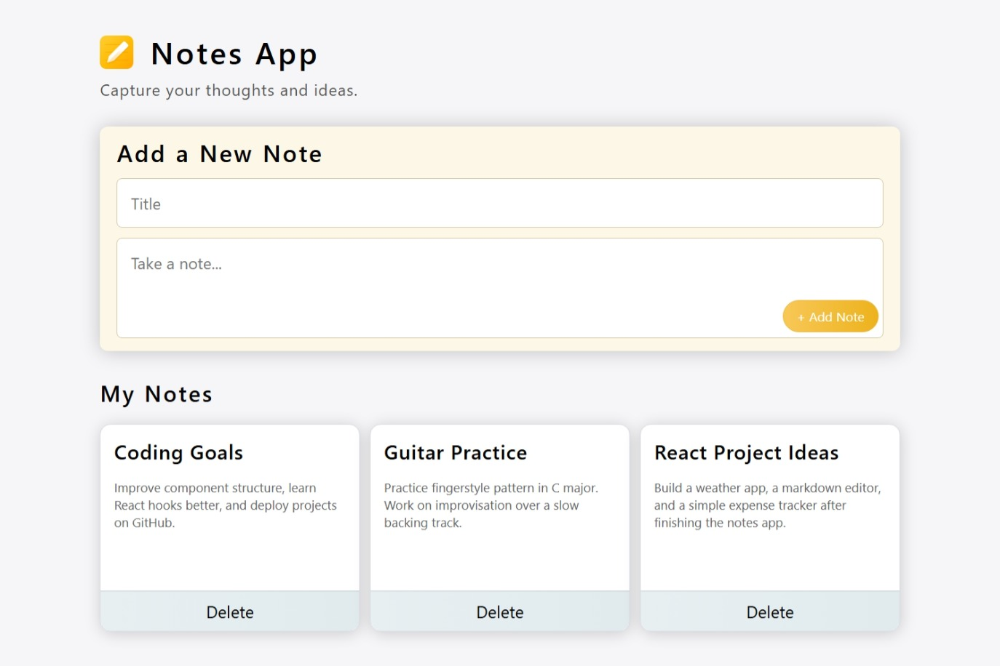

# 📝 Notes App

A clean and responsive Notes App built using React.  
This application allows users to quickly create and manage notes with persistent storage using the browser's LocalStorage.

---

## 📸 Preview



---

## 🚀 Features

- ➕ Add new notes
- 🗑️ Delete notes
- 💾 Notes saved using LocalStorage
- ⌨️ Press **Enter** to quickly add a new note
- 📱 Fully responsive design
- 🎨 Clean and modern UI
- ⚡ Built with React and Vite for fast performance

---

## 🛠️ Tech Stack

- **React**
- **Vite**
- **JavaScript (ES6+)**
- **CSS Modules**
- **LocalStorage API**

---

## 📂 Project Structure

```bash

├── README.md
├── screenshot/
    └── preview.jpeg
├── src/
    ├── assets/
    │   └── note-icon.png
    ├── main.jsx
    ├── components/
    │   ├── Header/
    │   │   ├── Header.jsx
    │   │   └── header.module.css
    │   ├── Noteslist/
    │   │   ├── NotesList.module.css
    │   │   └── NotesList.jsx
    │   ├── NoteCard/
    │   │   ├── NoteCard.jsx
    │   │   └── NoteCard.module.css
    │   └── AddNote/
    │   │   ├── AddNote.jsx
    │   │   └── AddNote.module.css
    ├── index.css
    └── App.jsx
├── vite.config.js
├── .gitignore
├── index.html
├── package.json
└── eslint.config.js

```

---

## 💡 How It Works

- Notes are stored in LocalStorage, so they remain saved even after refreshing the page.

- When a user creates a new note, the application updates both the React state and LocalStorage.

- Pressing Enter allows quick note creation without clicking the button.

---

## 👤 Author

**Yashkamal**
